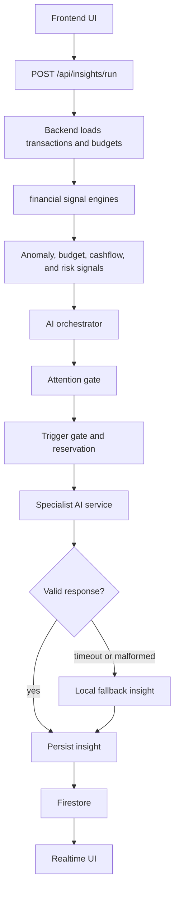

# SmartBudget

SmartBudget is a personal finance web app for tracking transactions, budgets, goals, reports, and AI-assisted financial insights.

The app combines deterministic financial engines with a backend AI pipeline. The deterministic engines calculate financial signals, while AI explains the most important signal in clear language.

## View Live

[https://smartbudget-beta.vercel.app/](https://smartbudget-beta.vercel.app/)

## Features

- Transaction tracking for income and expenses
- Budget creation and progress monitoring
- Goal tracking with contributions
- Reports with charts and export tools
- Smart insight cards
- Insight history
- Demo mode with seeded data
- Realtime Firestore updates
- Firebase Authentication
- Backend AI orchestration through Vercel API routes

## Insight Pipeline Flow



## Tech Stack

- React
- Vite
- Tailwind CSS
- Zustand
- Firebase Auth
- Firestore
- Firebase Admin
- Vercel Serverless Functions
- OpenAI-compatible AI client via `aisuite`
- Chart.js
- Framer Motion
- Vitest
- ESLint

## Project Structure

```text
smartbudget/
  .github/
    workflows/
      lint.yml
      vitest.yml
  api/
    ai/
      orchestrator.js
    insights/
      run.js
  backend/
    ai/
      fallbacks/
      orchestrator/
      prompts/
      services/
      shared/
      telemetry/
      triggers/
    financial-signals/
    userData/
    tests/
  docs/
    ai-architecture.md
    backend-ai-telemetry.md
    business-telemetry.md
    data-ingestion.md
    financial-signals.md
    identity-and-activation.md
    overview.md
    reliability-and-recovery.md
    TESTING.md
  lib/
    firebaseAdmin.js
    quota.js
  public/
  src/
    components/
    context/
    data/
    demo/
    firebase/
    hooks/
    initializer/
    layout/
    pages/
    routes/
    schema/
    store/
    tests/
    utils/
    App.jsx
    main.css
    main.jsx
  index.html
  package.json
  vercel.json
  vite.config.js
```

## Backend AI Areas

- `api/insights/run.js` is the frontend-facing insight pipeline route.
- `api/ai/orchestrator.js` remains the lower-level AI orchestration route.
- `backend/userData/` loads user transactions and budgets from Firestore.
- `backend/financial-signals/` builds deterministic anomaly, budget, cashflow, and risk signals.
- `backend/ai/services/orchestrator.js` coordinates the pipeline.
- `backend/ai/orchestrator/` contains scoring, attention, trigger, reservation, persistence, and agent execution helpers.
- `backend/ai/services/` contains specialist agents.
- `backend/ai/prompts/` contains prompt builders.
- `backend/ai/fallbacks/` contains local fallback insights.
- `backend/ai/telemetry/` records pipeline, agent, and insight metrics.

The financial signal engines originally lived in the frontend and now run in the backend so the UI only triggers the pipeline and displays persisted results.

## Documentation

- [SmartBudget Overview](./docs/overview.md)
- [Financial Signals](./docs/financial-signals.md)
- [AI Architecture](./docs/ai-architecture.md)
- [Backend AI Telemetry](./docs/backend-ai-telemetry.md)
- [Business Telemetry](./docs/business-telemetry.md)
- [Secure Data Ingestion](./docs/data-ingestion.md)
- [Identity and Account Activation](./docs/identity-and-activation.md)
- [Reliability and Failure Recovery](./docs/reliability-and-recovery.md)
- [Testing](./docs/TESTING.md)

## Scripts

```bash
npm run dev
npm run build
npm run lint
npm test
```

## Status

Public repository under active development.
