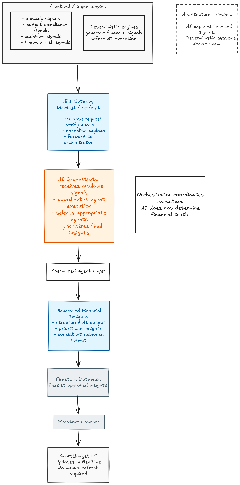
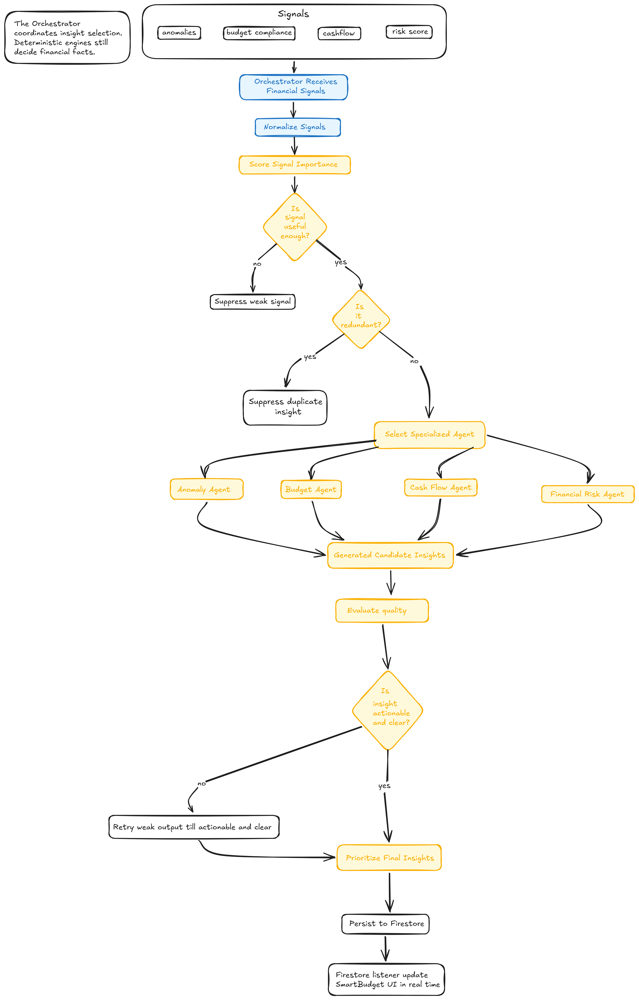

# SmartBudget AI Architecture

This document explains the AI-specific architecture in detail. For the concise product and system overview, see [SmartBudget Overview](./overview.md).

## Introduction

SmartBudget uses a hybrid AI architecture that combines deterministic financial analysis with AI-powered reasoning and communication.

**The platform separates:**
- financial signal generation
- AI interpretation, explanation, and orchestration

AI improves explanation quality, readability, personalization, and financial communication, but it does not determine financial truth. The system calculates financial conditions first, then AI explains and prioritizes them.

**This improves:**
- reliability
- predictability
- explainability
- maintainability

## Specialized AI Agents

**The AI architecture is divided into domain-specific agents:**
- anomaly agent
- budget compliance agent
- cash flow agent
- financial risk agent

**Each agent:**
- focuses on one financial domain
- receives structured financial data
- generates structured insight output

This keeps prompt engineering isolated, reduces cross-domain complexity, and makes the system easier to scale.

## Initial AI Architecture

**Initially:**
- prompts lived close to frontend logic
- AI requests were triggered from the frontend
- Vercel serverless functions handled model requests

The frontend generated financial signals, built prompts, called the AI gateway, and persisted insights.

This worked early on, but it became harder to maintain as the number of financial domains and prompts grew.

## Backend AI Migration

As SmartBudget evolved, the AI system moved into backend infrastructure.

**The migration introduced:**
- centralized AI execution
- backend-owned prompts
- reusable AI utilities
- shared model routing
- deterministic fallback systems
- isolated agent pipelines

This improved security, maintainability, scalability, orchestration readiness, and latency control.

## Current Backend AI Structure

The backend AI system is organized into modular layers.

### Agents

The agents layer contains specialized AI agents, AI client utilities, and model routing logic.

**Examples:**
- `runAnomalyAgent`
- `runBudgetAgent`
- `runCashflowAgent`
- `runRiskAgent`

### Prompts

Each agent owns its prompt builder. This keeps domain instructions focused and makes prompt iteration safer.

### Fallbacks

Each agent includes deterministic fallback logic.

**Fallbacks can be used when:**

- AI requests fail
- quota limits are reached
- model execution fails

This allows the system to return useful financial insights even when model execution is unavailable.

### Backend AI Flow Diagram

  

## Current Architecture Boundary

The frontend still generates financial signals.

**Examples:**
- anomaly detection
- budget compliance
- cash flow data
- financial risk data

These signals are passed into backend AI pipelines. This staged migration avoids destabilizing the system while backend orchestration is being developed.

## Orchestration Layer

The next major architectural layer is the orchestrator.

**The orchestrator reasons across multiple financial signals and determines:**

- which insights matter most
- which insights should be suppressed
- whether an insight is useful enough to persist
- which financial agent should be called first

The orchestrator acts as the intelligence coordination layer of SmartBudget.

## Planned Orchestrator Flow

1. Frontend signal engines generate financial signals such as anomalies, budget compliance, cash flow, and risk score.
2. The orchestrator receives and normalizes those signals.
3. The orchestrator scores signal importance.
4. Weak signals are suppressed before agent execution.
5. Redundant signals are suppressed to avoid duplicate insights.
6. The orchestrator selects the most relevant specialized agent.
7. The selected agent generates a candidate insight.
8. The orchestrator evaluates whether the insight is actionable and clear.
9. Weak outputs are retried only up to a maximum retry count.
10. If the retry limit is reached, the AI loop exits and falls back to a rule-based insight.
11. Valid insights are prioritized, persisted to Firestore, and displayed in the SmartBudget UI through the Firestore listener.

This architecture enables adaptive prioritization and iterative evaluation while preventing infinite retry loops and runaway API costs.

### Orchestration Flow Diagram

  

The diagram follows the planned orchestration path from financial signals through signal scoring, suppression, agent selection, candidate insight generation, quality evaluation, prioritization, Firestore persistence, and UI updates. The retry branch should be implemented with a maximum retry count; once that limit is reached, the system exits the AI retry loop and uses a rule-based fallback.

## Future Direction and Improvements

The current AI infrastructure uses Node.js and serverless functions because that keeps the system close to the frontend, fast to iterate on, and simple to deploy while the insight pipeline is still evolving.

The long-term direction is to move the advanced AI layer toward agentic orchestration. In that model, specialized financial agents become callable tools, and the orchestrator decides which tool to use based on the user's financial signals, insight history, and current context.

**This future architecture would allow SmartBudget to:**

- select the most relevant agent dynamically
- evaluate insight quality before persistence
- retry weak outputs or use deterministic fallbacks
- suppress redundant or low-value insights
- reason across historical financial behavior
- prioritize insights based on urgency and usefulness

As orchestration becomes more complex, a Python-based AI service may become a better fit for the advanced AI runtime. Python has stronger ecosystem support for workflow graphs, evaluation pipelines, memory systems, machine learning integration, and orchestration frameworks such as LangChain, LangGraph, and CrewAI.

**The migration should happen gradually:**

1. stabilize the current backend agent pipelines
2. complete the orchestration architecture
3. isolate the orchestration runtime from the core app backend
4. move advanced AI workflows into Python services when the complexity justifies it

The goal is to evolve SmartBudget from isolated AI insight generation into coordinated financial intelligence, while keeping deterministic financial signal engines responsible for calculating financial facts.

## Core Architecture Philosophy

SmartBudget intentionally avoids fully autonomous financial decision-making.

**Instead:**

- financial analysis remains deterministic
- AI handles reasoning and communication

This balances trust, adaptability, reliability, personalization, and scalability.

For financial products, predictability is more important than unrestricted autonomy.
