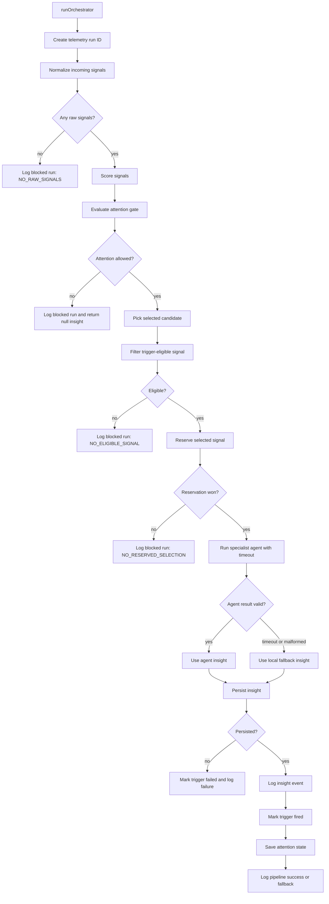

# SmartBudget AI Architecture

SmartBudget uses a hybrid AI architecture: deterministic engines calculate financial facts, and AI explains the most important fact in clear language.

For the product-level summary, see [SmartBudget Overview](./overview.md). For deterministic signal details, see [Financial Signals](./financial-signals.md). For telemetry, see [Backend AI Telemetry](./backend-ai-telemetry.md).

## Core Idea

AI does not decide financial truth in SmartBudget.

The backend first calculates structured signals from user data:

- anomaly signals
- budget compliance signals
- cashflow signals
- financial risk signals

The backend AI pipeline then decides which signal deserves attention, runs the right specialist agent, validates the result, persists the insight, and lets the UI update in real time.

## Current Architecture

```mermaid
flowchart TD
  A[Frontend UI] --> B[Vercel API: /api/insights/run]
  B --> C[Load transactions and budgets from Firestore]
  C --> D[Backend financial signal engines]
  D --> E[Anomalies]
  D --> F[Budget compliance]
  D --> G[Cashflow data]
  D --> H[Financial risk data]

  E --> I[Backend orchestrator]
  F --> I
  G --> I
  H --> I

  I --> J[Normalize signals]
  J --> K[Score signals]
  K --> L[Attention gate]
  L --> M[Trigger gate and reservation]
  M --> N[Selected specialist agent]

  N --> O[AI client and model router]
  O --> P{Valid agent insight?}
  P -->|yes| Q[Persist insight]
  P -->|timeout or malformed| R[Local fallback insight]
  R --> Q

  Q --> S[Firestore: users/{userId}/insights]
  S --> T[Realtime listener]
  T --> U[Insight cards and history UI]

  I --> V[Telemetry]
  N --> V
  Q --> V
```

## Main Backend Layers

### API Route

```text
api/ai/orchestrator.js
```

`api/insights/run.js` is the frontend-facing route. It receives `userId`, `currency`, and `isDemo`, loads transactions and budgets from Firestore, runs backend financial signal engines, and passes the resulting signals into the orchestrator.

`api/ai/orchestrator.js` remains the lower-level AI route for direct orchestrator execution.

### Financial Signals

```text
backend/financial-signals/
backend/userData/loadFinancialData.js
```

The financial signal layer is now backend-owned. It reads user transactions and budgets, then builds anomaly, budget, cashflow, and risk data before AI orchestration begins.

### Orchestrator

```text
backend/ai/services/orchestrator.js
backend/ai/orchestrator/
```

The orchestrator coordinates the AI pipeline. It normalizes signals, scores them, checks attention state, checks trigger eligibility, reserves one signal, runs one specialist agent, persists the result, updates attention state, and logs telemetry.

### Specialist Agents

```text
backend/ai/services/anomaly.js
backend/ai/services/budget.js
backend/ai/services/cashflow.js
backend/ai/services/risk.js
```

Each agent handles one domain. This keeps prompts smaller and makes fallback behavior easier to reason about.

### Prompts and Fallbacks

```text
backend/ai/prompts/
backend/ai/fallbacks/
```

Prompts generate AI explanations. Fallbacks provide local rule-based insight text when the AI provider fails, times out, or returns malformed output.

### Shared AI Utilities

```text
backend/ai/services/aiClient.js
backend/ai/shared/modelRouter.js
backend/ai/shared/systemContent.js
backend/ai/shared/formatAmount.js
```

These files handle model calls, model selection, shared system instructions, and formatting helpers.

## Orchestration Flow


```mermaid
flowchart TD
  A[runOrchestrator] --> B[Create telemetry run ID]
  B --> C[Normalize incoming signals]
  C --> D{Any raw signals?}
  D -->|no| E[Log blocked run: NO_RAW_SIGNALS]
  D -->|yes| F[Score signals]

  F --> G[Evaluate attention gate]
  G --> H{Attention allowed?}
  H -->|no| I[Log blocked run and return null insight]
  H -->|yes| J[Pick selected candidate]

  J --> K[Filter trigger-eligible signal]
  K --> L{Eligible?}
  L -->|no| M[Log blocked run: NO_ELIGIBLE_SIGNAL]
  L -->|yes| N[Reserve selected signal]

  N --> O{Reservation won?}
  O -->|no| P[Log blocked run: NO_RESERVED_SELECTION]
  O -->|yes| Q[Run specialist agent with timeout]

  Q --> R{Agent result valid?}
  R -->|yes| S[Use agent insight]
  R -->|timeout or malformed| T[Use local fallback insight]

  S --> U[Persist insight]
  T --> U
  U --> V{Persisted?}
  V -->|no| W[Mark trigger failed and log failure]
  V -->|yes| X[Log insight event]
  X --> Y[Mark trigger fired]
  Y --> Z[Save attention state]
  Z --> AA[Log pipeline success or fallback]
```

## Safety Rails

SmartBudget uses several guardrails before an insight reaches the UI:

- quota checks before the AI pipeline runs
- attention gate to avoid repeating unchanged episodes
- trigger gate to avoid duplicate insight firing
- reservation transaction to prevent race-condition duplicates
- agent timeout to avoid hanging provider calls
- runtime schema validation for `agent.explanation` and `agent.suggestion`
- local fallback insight when AI fails
- Firestore persistence check before marking a trigger as fired

## Attention State

Attention state remembers the active financial episode for a user. If the same issue is still unchanged, the orchestrator blocks another insight. If the issue worsens, a new material signal appears, or cooldown expires, the orchestrator can generate another insight.

This keeps the insight feed useful instead of noisy.

## Telemetry

The AI pipeline logs:

- full pipeline runs
- selected agent runs
- generated insight events

Telemetry is used to measure reliability, latency, fallback rate, blocked reasons, and insight volume during pilots.

## Current Direction

The architecture is growing toward an institution-ready pilot system. The current focus is:

- reliable backend orchestration
- deterministic financial signals
- safe AI explanations
- local fallbacks
- measurable telemetry
- real-time insight delivery

The long-term path can still move toward deeper agentic orchestration, but only after the current deterministic and telemetry foundations are stable.
