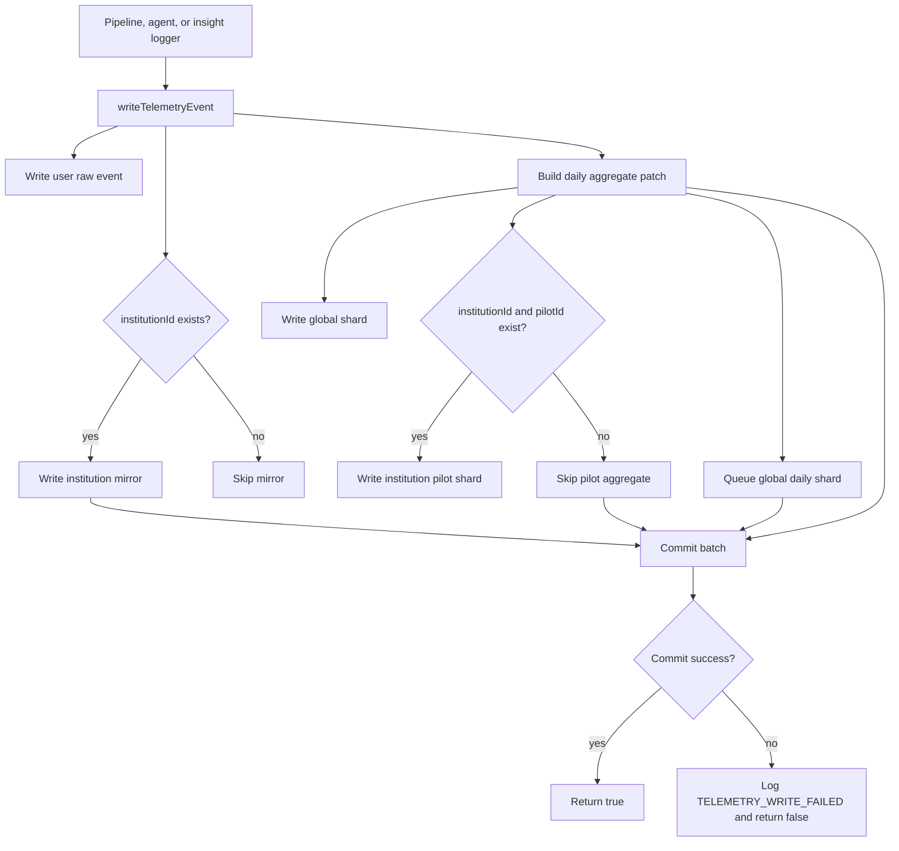
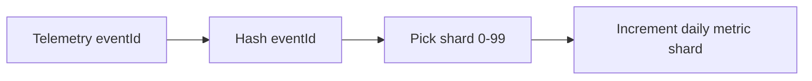

# SmartBudget Backend AI Telemetry

This document explains the backend telemetry used to measure SmartBudget's AI pipeline during pilot trials.

For the broader AI system, see [SmartBudget AI Architecture](./ai-architecture.md).

## Purpose

Telemetry gives SmartBudget measurable proof of how the AI system behaves in real usage.

It answers questions such as:

- Did the AI pipeline run successfully?
- Was the run blocked by the attention or trigger gate?
- Did the agent finish normally, time out, or use fallback text?
- Was an insight generated and persisted?
- How long did the pipeline and agent take?
- How many high, medium, or low severity insights were generated?

This is important for institution pilots because the institution needs to see reliability, fallback behavior, and risk-signal activity before trusting the system with a larger user base.

## Main Events

The telemetry system currently records three event categories.

### `aiPipelineRuns`

Records one full orchestrator run.

It tracks:

- run status: `success`, `fallback`, `failed`, or `blocked`
- orchestration reason, such as `NO_ACTIVE_EPISODE` or `ACTIVE_EPISODE_UNCHANGED`
- raw and scored signal counts
- selected signal type and ID
- attention gate result
- trigger and reservation result
- persistence result
- fallback usage
- total pipeline duration

### `aiAgentRuns`

Records the selected AI agent execution.

It tracks:

- agent type
- agent duration
- timeout status
- schema validity
- fallback usage
- fallback reason
- model used
- execution error, when available

This is the main event for measuring AI safety and fallback reliability.

### `insightEvents`

Records generated insight events.

The current backend event type is:

```text
INSIGHT_GENERATED
```

It tracks:

- insight ID and type
- selected signal type and ID
- severity
- fallback status
- model used
- orchestration reason

## Firestore Paths

Telemetry is stored in raw event paths and daily aggregate paths.

### User Raw Events

Detailed user-level records for debugging and audit.

```text
users/{userId}/telemetry/{category}/events/{eventId}
```

Examples:

```text
users/{userId}/telemetry/aiPipelineRuns/events/{runId}
users/{userId}/telemetry/aiAgentRuns/events/{agentRunId}
users/{userId}/telemetry/insightEvents/events/{eventId}
```

### Institution Raw Mirrors

Written only when `institutionId` exists.

```text
institutions/{institutionId}/{category}/{eventId}
```

These make institution-level review easier without scanning every user path.

### Global Daily Metrics

Used for platform-wide admin metrics.

```text
globalMetrics/daily/records/{dateKey}__{category}/shards/{shardId}
```

Example:

```text
globalMetrics/daily/records/2026-07-31__aiPipelineRuns/shards/42
```

### Institution Pilot Daily Metrics

Written only when both `institutionId` and `pilotId` exist.

```text
institutions/{institutionId}/pilots/{pilotId}/dailyMetrics/{dateKey}__{category}/shards/{shardId}
```

These support pilot dashboards without scanning raw telemetry events.

## Write Flow



All queued telemetry writes are committed in one Firestore batch. If the batch fails, the error is logged and the AI pipeline continues.

## Daily Metrics

Daily metrics are counters used by future dashboards.

### Pipeline Metrics

```text
totalPipelineRuns
successfulPipelineRuns
fallbackPipelineRuns
failedPipelineRuns
blockedPipelineRuns
totalPipelineDurationMs
persistedInsights
fallbackInsights
rawSignalsSeen
scoredSignalsSeen
attentionAllowedRuns
attentionBlockedRuns
triggerEligibleRuns
triggerBlockedRuns
reservationAllowedRuns
reservationBlockedRuns
```

Useful dashboard values:

- average pipeline latency
- pipeline success rate
- fallback rate
- blocked run rate
- persistence rate
- attention and trigger block rates

### Agent Metrics

```text
totalAgentRuns
successfulAgentRuns
fallbackAgentRuns
failedAgentRuns
timeoutAgentRuns
malformedAgentRuns
totalAgentDurationMs
```

Useful dashboard values:

- average agent latency
- timeout rate
- fallback rate
- malformed output rate

### Insight Metrics

```text
totalInsightEvents
generatedInsights
fallbackInsightEvents
highSeverityInsights
mediumSeverityInsights
lowSeverityInsights
```

Useful dashboard values:

- total generated insights
- fallback insight share
- high, medium, and low severity distribution

## Sharding

Daily aggregate metrics use deterministic sharding.

Current shard count:

```text
100 shards
```

The shard is selected from the event ID using a hash. This spreads writes across many documents while keeping shard selection predictable.

Without sharding, every run for the same day and category would update the same document. That can create a Firestore hot document during high activity. With sharding, writes are spread across smaller metric documents.

Dashboard reads should read all shard documents for the date/category and sum the counters.



## Dashboard Read Strategy

Use aggregate paths for charts and summaries.

Read global metrics from:

```text
globalMetrics/daily/records/{dateKey}__{category}/shards
```

Read pilot metrics from:

```text
institutions/{institutionId}/pilots/{pilotId}/dailyMetrics/{dateKey}__{category}/shards
```

Then sum the fields across the shard documents.

Use raw event paths only for debugging, audit trails, or detailed investigation.

## Pilot Context

Telemetry supports these optional fields:

```text
institutionId
pilotId
cohortId
```

They can be `null` for normal app usage. During institution pilots, they allow metrics to be grouped by institution, pilot, and selected user cohort.

## Tradeoffs

The current design intentionally writes more than one record for some events.

The benefit is faster dashboard reads and easier institution-level reporting.

The cost is extra Firestore writes, especially when institution and pilot IDs exist. For a controlled 500-1,000 user pilot, this is acceptable because it avoids expensive dashboard queries across many user subcollections.

SmartBudget keeps raw events as the source of truth and uses daily aggregates for fast reporting.

## Failure Behavior

Telemetry should never break insight generation.

`writeTelemetryEvent` catches write errors, logs `TELEMETRY_WRITE_FAILED`, and returns `false`.

The Firestore batch is atomic. If one write in the batch fails, none of the queued telemetry writes are committed. This avoids partial metrics where one path updates but another does not.

## Implementation Files

```text
backend/ai/telemetry/logger.js
backend/ai/telemetry/writeTelemetryEvent.js
backend/ai/telemetry/utils.js
backend/ai/services/orchestrator.js
backend/ai/orchestrator/agentExecution.js
```

`logger.js` exposes the logging functions.

```text
createTelemetryRunId
buildTelemetryContext
logAIPipelineRun
logAIAgentRun
logInsightEvent
```

`writeTelemetryEvent.js` handles Firestore writes, aggregate patches, sharding, and failure handling.

