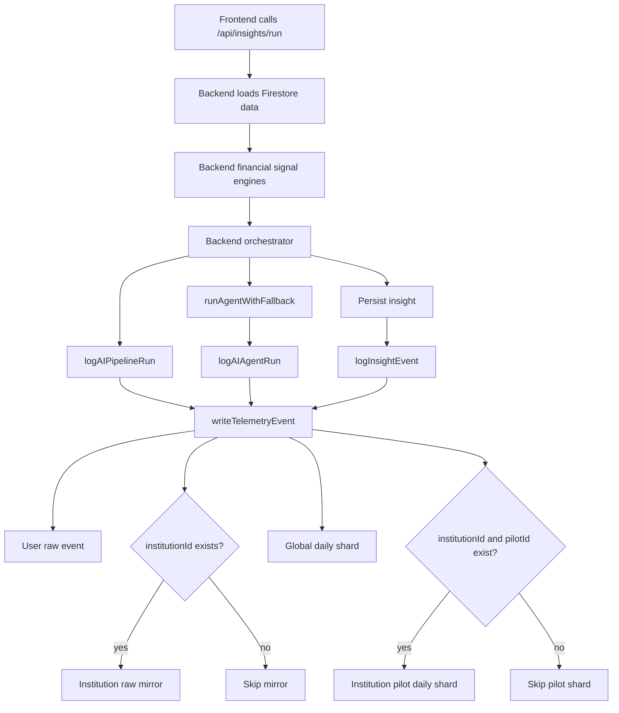
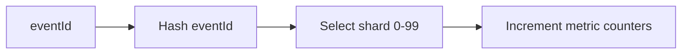

# SmartBudget Backend AI Telemetry

SmartBudget telemetry records how the backend AI pipeline behaves during real usage and pilot trials.

For the wider AI flow, see [SmartBudget AI Architecture](./ai-architecture.md). For the deterministic facts that feed the pipeline, see [Financial Signals](./financial-signals.md).

## Purpose

Telemetry helps answer simple but important questions:

- Did the AI pipeline run?
- Did it succeed, fail, fallback, or get blocked?
- Which gate blocked it?
- Did the agent time out?
- Was the AI output malformed?
- Was an insight persisted?
- How long did the run take?

This gives SmartBudget evidence of reliability, safety, and insight activity for institution pilots.

## Telemetry Architecture



## Event Types

### `aiPipelineRuns`

One full orchestrator run.

Tracks:

- status: `success`, `fallback`, `failed`, or `blocked`
- reason
- duration
- signal counts
- selected signal
- attention result
- trigger and reservation result
- persistence result
- fallback usage

### `aiAgentRuns`

One selected specialist agent run.

Tracks:

- agent type
- duration
- timeout status
- schema validity
- fallback usage
- fallback reason
- model used
- error, when available

### `insightEvents`

One generated insight event.

Current event:

```text
INSIGHT_GENERATED
```

Tracks:

- insight ID and type
- selected signal
- severity
- fallback status
- model used
- orchestration reason

## Firestore Paths

### User Raw Events

```text
users/{userId}/telemetry/{category}/events/{eventId}
```

Used for debugging and user-level audit trails.

### Institution Raw Mirrors

```text
institutions/{institutionId}/{category}/{eventId}
```

Written only when `institutionId` exists.

### Global Daily Metrics

```text
globalMetrics/daily/records/{dateKey}__{category}/shards/{shardId}
```

Used for platform-wide reporting.

### Institution Pilot Daily Metrics

```text
institutions/{institutionId}/pilots/{pilotId}/dailyMetrics/{dateKey}__{category}/shards/{shardId}
```

Written only when both `institutionId` and `pilotId` exist.

## Sharding

Daily metrics use deterministic sharding.

```text
100 shards
```

The shard is chosen by hashing the event ID. This spreads writes across many documents and reduces the chance of a hot Firestore document during high activity.

Dashboard reads should load all shards for a date/category and sum the counters.



## Key Daily Counters

Pipeline counters include:

```text
totalPipelineRuns
successfulPipelineRuns
fallbackPipelineRuns
failedPipelineRuns
blockedPipelineRuns
totalPipelineDurationMs
persistedInsights
fallbackInsights
attentionAllowedRuns
attentionBlockedRuns
triggerEligibleRuns
triggerBlockedRuns
reservationAllowedRuns
reservationBlockedRuns
```

Agent counters include:

```text
totalAgentRuns
successfulAgentRuns
fallbackAgentRuns
failedAgentRuns
timeoutAgentRuns
malformedAgentRuns
totalAgentDurationMs
```

Insight counters include:

```text
totalInsightEvents
generatedInsights
fallbackInsightEvents
highSeverityInsights
mediumSeverityInsights
lowSeverityInsights
```

## Dashboard Strategy

Use aggregate shards for charts and summaries.

Use raw events only for detailed investigation.

This keeps dashboard reads fast while preserving raw records for debugging.

## Decisions and Tradeoffs

### Raw Events and Aggregates

SmartBudget stores both raw telemetry events and daily aggregate metrics.

Raw events are useful when investigating one user, one agent run, or one failed pipeline. Aggregates are better for dashboards because the dashboard does not need to scan many raw event documents just to calculate totals.

The tradeoff is extra writes. Each telemetry event can write the raw event plus aggregate counters. This is acceptable for pilot scale because it makes reporting faster and easier to trust.

### User Paths and Institution Paths

User telemetry stays under:

```text
users/{userId}/telemetry/{category}/events/{eventId}
```

Institution mirrors are written only when `institutionId` exists.

This keeps normal user telemetry simple while still supporting institution-level review during pilots.

The tradeoff is duplicated data when institution context exists. The benefit is that institution reporting does not need to scan every user path.

### Daily Metrics Instead of Only Collection Group Queries

Firestore collection group queries can read across many user telemetry paths, but they still depend on raw event records.

Daily metrics are stored separately so dashboards can read small counter documents instead of recalculating everything from raw events.

The tradeoff is that aggregate fields must be maintained carefully. The benefit is predictable dashboard performance.

### Sharded Counters

Daily metric writes are sharded across 100 documents.

This avoids sending every write for the same date/category into one Firestore document.

The tradeoff is that dashboard reads must sum multiple shard documents. This is a reasonable tradeoff because reading 100 small shard documents is more predictable than risking a hot document during high activity.

### Atomic Batch Writes

Telemetry writes use a Firestore batch.

If the raw event, institution mirror, or aggregate update fails, the batch does not partially commit.

The tradeoff is all-or-nothing behavior. The benefit is consistency: dashboards do not show metrics that cannot be traced back to a matching raw event.

## Failure Behavior

Telemetry must not break insight generation.

`writeTelemetryEvent` catches write errors, logs `TELEMETRY_WRITE_FAILED`, and returns `false`.

The Firestore batch is atomic. If one telemetry write in the batch fails, none of the queued telemetry writes are committed.

## Implementation Files

```text
backend/ai/telemetry/logger.js
backend/ai/telemetry/writeTelemetryEvent.js
backend/ai/telemetry/utils.js
backend/ai/services/orchestrator.js
backend/ai/orchestrator/agentExecution.js
```

## Current Direction

This telemetry layer is built for pilot reporting first. The next step is to grow it into a stronger institution reporting system.

Planned enhancements include:

- weekly or monthly rollups
- insight view/dismiss events
- retention cleanup rules
- BigQuery export
- institution repayment/default metrics

These are not blockers for the current pipeline. They are the next reporting features needed as pilots mature and the dashboard starts answering broader institution questions.
