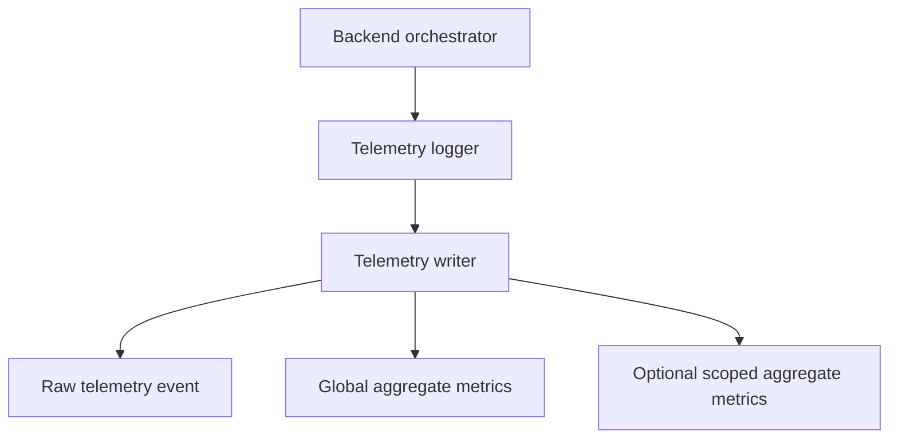
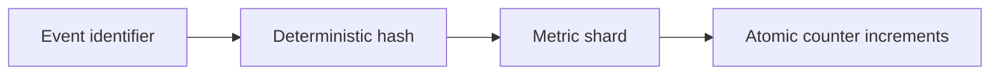

# SmartBudget Backend AI Telemetry

SmartBudget records how the backend insight pipeline behaves during real usage. This is operational telemetry: it explains whether the pipeline ran, which control path it followed, whether fallback logic was needed, and whether an insight was saved.

For the wider insight flow, see [SmartBudget AI Architecture](./ai-architecture.md). For product engagement events, see [Business Telemetry](./business-telemetry.md).

## Purpose

The telemetry layer helps answer:

- Did the insight pipeline run?
- Did it succeed, fail, use a fallback, or get blocked?
- Which attention, trigger, or reservation decision affected the run?
- Did the selected specialist time out or return invalid output?
- Was the resulting insight persisted?
- How long did the pipeline and selected specialist take?

These signals support debugging, reliability measurement, and aggregate system evaluation.

## Architecture



Telemetry can optionally be associated with a broader integration scope. This allows aggregate reporting without scanning every individual user telemetry collection.

## Event Categories

### Pipeline Runs

`aiPipelineRuns` represents one complete orchestrator run. It records:

- final status: `success`, `fallback`, `failed`, or `blocked`
- completion or blocking reason
- pipeline duration
- raw and scored signal counts
- highest-ranked and selected signal details
- attention, trigger, and reservation outcomes
- persistence and fallback outcomes

### Specialist Runs

`aiAgentRuns` represents the one specialist selected for a pipeline run. It records:

- specialist type
- duration
- success or fallback status
- timeout state
- output-schema validity
- fallback reason
- model identifier when available

### Insight Events

`insightEvents` records an insight generated by the backend. The current generation event is:

```text
INSIGHT_GENERATED
```

It associates the insight with its selected signal, severity, fallback state, model, and orchestration reason.

## Raw and Aggregate Telemetry

Raw user events are retained for focused investigation:

```text
users/{userId}/telemetry/{category}/events/{eventId}
```

Daily aggregate counters support charts and summaries without repeatedly scanning raw events. The writer maintains global aggregates and can maintain aggregates for an optional integration scope.

Raw events answer questions about one run. Aggregates answer questions about system behavior over time. Maintaining both costs additional writes but keeps operational investigation and dashboard queries straightforward.

## Deterministic Sharding

Aggregate writes are distributed across deterministic shards selected from the event identifier. This reduces write concentration when many events update the same daily metric.



Readers combine the relevant shards for a date and category. The exact shard count is an internal tuning detail rather than part of the telemetry contract.

## Aggregate Counters

Pipeline aggregates include:

```text
totalPipelineRuns
successfulPipelineRuns
fallbackPipelineRuns
failedPipelineRuns
blockedPipelineRuns
totalPipelineDurationMs
persistedInsights
fallbackInsights
attentionAllowedRuns
attentionBlockedRuns
triggerEligibleRuns
triggerBlockedRuns
reservationAllowedRuns
reservationBlockedRuns
```

Specialist aggregates include:

```text
totalAgentRuns
successfulAgentRuns
fallbackAgentRuns
failedAgentRuns
timeoutAgentRuns
malformedAgentRuns
totalAgentDurationMs
```

Insight aggregates include generated-event totals, fallback totals, and severity totals.

## Atomic Writes

The telemetry writer uses a Firestore batch for the raw event and its aggregate counter updates. Either the queued writes commit together or none of them commit. This prevents an aggregate from representing a raw event that was never written.

## Failure Behavior

Telemetry is secondary to insight generation. A telemetry failure is reported as an operational error, but the writer returns a failure result instead of intentionally terminating the main insight flow.

Because the telemetry batch is atomic, a failed write does not leave a partially updated telemetry record set.

## Dashboard Strategy

Dashboards should read aggregate metrics for trends and summaries. Raw events should be reserved for targeted debugging and audit work.

This approach trades a small increase in write volume for predictable reporting reads and traceable operational metrics.

## Implementation Files

```text
backend/ai/telemetry/logger.js
backend/ai/telemetry/writeTelemetryEvent.js
backend/ai/telemetry/utils.js
backend/ai/services/orchestrator.js
backend/ai/orchestrator/agentExecution.js
```

## Current Direction

The telemetry layer currently focuses on operational reliability and aggregate system behavior.

Planned improvements include:

- weekly and monthly rollups
- broader insight engagement events
- retention and cleanup policies
- analytical data export
- broader product-level metrics
