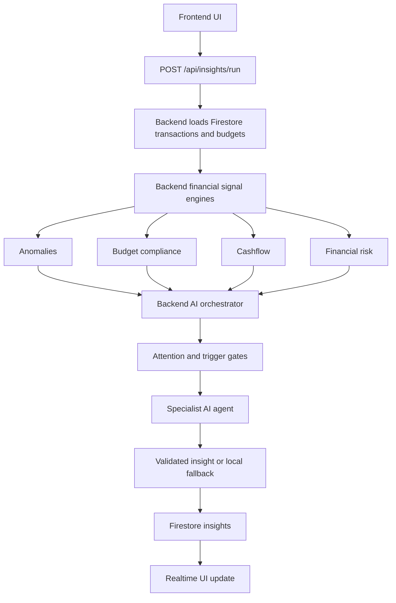

# SmartBudget Overview

SmartBudget is a personal finance web app that helps users track transactions, manage budgets, monitor goals, and receive real-time financial insights.

For deeper details, see [Financial Signals](./financial-signals.md), [SmartBudget AI Architecture](./ai-architecture.md), [Backend AI Telemetry](./backend-ai-telemetry.md), and [SmartBudget Testing](./TESTING.md).

It combines deterministic financial analysis with AI-powered explanation. The system calculates financial facts first, then AI explains the most important issue in simple language.

## What SmartBudget Does

Users can:

- track income and expenses
- create category budgets
- monitor financial goals
- view reports and charts
- receive smart insight cards
- review active and historical insights

The goal is not only to show numbers. SmartBudget helps users understand spending behavior, budget pressure, cashflow issues, and overall financial risk.

## Current System

## AI Principle

SmartBudget does not let AI invent financial conditions.

Deterministic engines calculate:

- anomalies
- budget compliance
- cashflow pressure
- financial risk

AI then explains those signals and suggests a practical next step.

This keeps the system more predictable, testable, and easier to trust.

## Backend AI Pipeline

The backend AI pipeline now includes:

- Vercel API route for AI requests
- quota checks
- backend orchestrator
- attention gate
- trigger gate
- signal reservation
- specialist agents
- runtime output validation
- timeout fallback
- Firestore persistence
- telemetry

For details, see [SmartBudget AI Architecture](./ai-architecture.md) and [Financial Signals](./financial-signals.md).

## Telemetry

SmartBudget records AI pipeline telemetry so pilot behavior can be measured.

It tracks:

- successful runs
- blocked runs
- fallback usage
- agent timeouts
- malformed AI outputs
- generated insights
- pipeline and agent duration

For details, see [Backend AI Telemetry](./backend-ai-telemetry.md).

## Direction

SmartBudget is growing toward a more institution-ready system with safer AI execution, measurable reliability, and clearer backend boundaries.

The core design remains the same:

- deterministic engines calculate financial truth
- AI explains and communicates
- fallbacks protect the user experience
- telemetry proves how the system behaves
