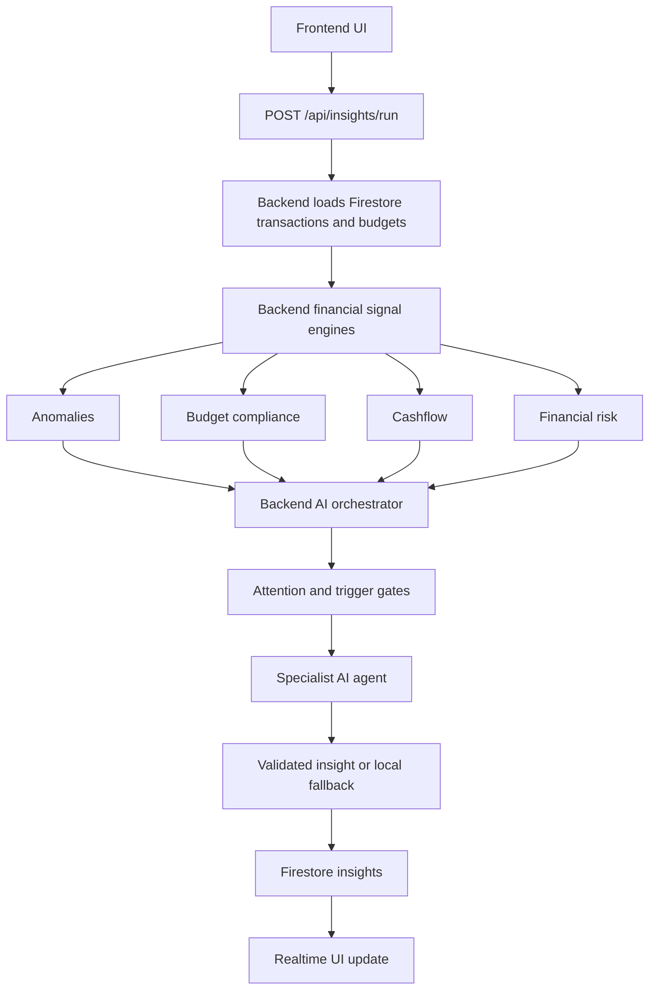

# Vydra Overview

Vydra is a personal financial intelligence platform for understanding financial activity, identifying meaningful patterns, and making informed financial decisions.

For deeper details, see [Financial Signals](./financial-signals.md), [Vydra AI Architecture](./ai-architecture.md), [AI Telemetry](./ai-telemetry.md), [Secure Data Ingestion](./data-ingestion.md), [Identity and Account Activation](./identity-and-activation.md), [Reliability and Failure Recovery](./reliability-and-recovery.md), and [Vydra Testing](./TESTING.md).

It combines deterministic financial analysis with AI-powered explanation. The system calculates financial facts first, then AI explains the most important issue in simple language.

## What Vydra Does

Users can:

- track income and expenses
- create category budgets
- monitor financial goals
- view reports and charts
- receive smart insight cards
- review active and historical insights

The goal is not only to show numbers. Vydra helps users understand spending behavior, budget pressure, cashflow issues, and overall financial risk.

## Current System


```mermaid
flowchart TD
  A[Frontend UI] --> B[POST /api/insights/run]
  B --> C[Backend loads Firestore transactions and budgets]
  C --> D[Backend financial signal engines]
  D --> E[Anomalies]
  D --> F[Budget compliance]
  D --> G[Cashflow]
  D --> H[Financial risk]

  E --> I[Backend AI orchestrator]
  F --> I
  G --> I
  H --> I
  I --> J[Attention and trigger gates]
  J --> K[Specialist AI agent]
  K --> L[Validated insight or local fallback]
  L --> M[Firestore insights]
  M --> N[Realtime UI update]
```

## AI Principle

Vydra does not let AI invent financial conditions.

Deterministic engines calculate:

- anomalies
- budget compliance
- cashflow pressure
- financial risk

AI then explains those signals and suggests a practical next step.

This keeps the system more predictable, testable, and easier to trust.

## AI Pipeline

The AI pipeline now includes:

- Vercel API route for AI requests
- quota checks
- backend orchestrator
- attention gate
- trigger gate
- signal reservation
- specialist agents
- runtime output validation
- timeout fallback
- Firestore persistence
- telemetry

For details, see [Vydra AI Architecture](./ai-architecture.md) and [Financial Signals](./financial-signals.md).

## Telemetry

Vydra records AI pipeline telemetry so system behavior and reliability can be measured.

It tracks:

- successful runs
- blocked runs
- fallback usage
- agent timeouts
- malformed AI outputs
- generated insights
- pipeline and agent duration

For details, see [AI Telemetry](./ai-telemetry.md).

## External Data Sources

Vydra supports scoped ingestion of structured customer and transaction data without coupling file transport to domain logic.

```text
External data source
-> secure ingestion
-> validation and import
-> canonical application data
```

For details, see [Secure Data Ingestion](./data-ingestion.md).

## Direction

Vydra is evolving toward stronger backend reliability, safer AI execution, measurable system behavior, and clearer service boundaries.

The core design remains the same:

- deterministic engines calculate financial truth
- AI explains and communicates
- fallbacks protect the user experience
- telemetry proves how the system behaves
